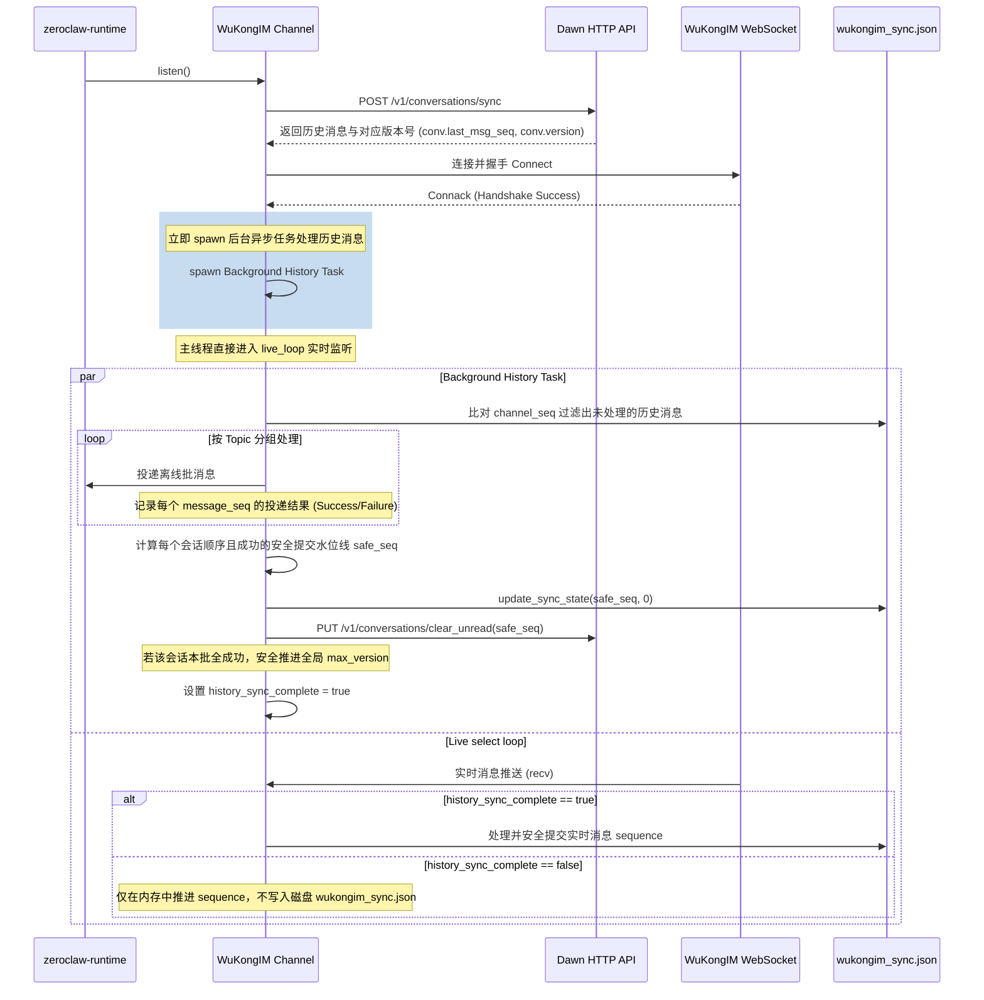

# 设计规格书：WuKongIM 历史消息同步安全提交与异步化设计

本设计规格书针对 WuKongIM 历史消息同步在多 Topic 场景下的安全漏洞（提前提交、非确定性处理和并发写冲突）进行了架构层面的规范和定义，以实现高可靠的、遵循“先处理后提交（Process-then-Commit）”的会话级消息递送。

## 1. 痛点问题

1.  **历史消息处理阻塞与死锁**：历史消息（如携带大图片、多媒体文件等）的下载和处理可能需要较长时间，导致 `listen` 函数在启动时被长时间阻塞。在此期间，客户端无法处理 WebSocket 消息和心跳（Ping/Pong），极易被服务器判定为连接超时断开。此外，如果在没有运行 Websocket 读取循环的情况下调用 `listen` 内的历史消息处理，而智能体试图发送消息并等待 RPC 响应，将发生死锁。
2.  **Fetch-then-Commit 漏洞**：先前的实现在获取到历史消息后，立即无条件更新本地的 sequence 和全局 `max_version`。若后续投递处理失败（如崩溃、进程强制退出等），这些消息在重启后会被过滤跳过，从而造成永久漏单。
3.  **Topic 分组导致的乱序水位线更新**：在同一个通道（Channel）中，历史消息被按 Topic 进行分割拆散后交给多个智能体实例处理。由于哈希表（HashMap）遍历的随机性，可能较小序列号的消息因处理失败或延迟，而在大序列号消息处理成功并提交后才进行处理。如果中途崩溃，这部分小序列号消息在重启后由于 sequence 大于当前记录而被忽略。
4.  **并发写状态文件冲突**：后台任务与实时 select 循环并发执行状态持久化写时可能产生状态覆写。

## 2. 详细设计架构

### 2.1 整体时序流程 (Sequence Flow)

### 2.2 核心模块规范

#### 1. 并发锁与同步控制字段 (`channel.rs`)
更新 `WuKongIMChannel` 结构体，引入并发锁与状态完成标识：
- `sync_state_lock: Arc<tokio::sync::Mutex<()>>`：用于互斥保护 `wukongim_sync.json` 文件写操作。
- `history_sync_complete: Arc<std::sync::atomic::AtomicBool>`：在后台历史消息处理全数提交并写回水位线之前，为 `false`。此时实时消息仅写入本地 `Memory`（SQLite），而暂时不写入磁盘上的配置文件中，从而保证崩溃重启后仍可重现之前的全部未处理位点。

#### 2. 安全提交水位线算法 (`calculate_safe_watermark`)
定义一个纯函数进行水位线计算，它接收：
- 当前位点 `current_seq`
- 对应会话本次同步获取的所有新消息列表 `conv_messages`（按 `message_seq` 升序排列）
- 各消息的处理成败映射表 `processed_messages`
- 本次同步接口返回的最大位点 `last_msg_seq`

**算法逻辑**：
1. 若本次同步未拉取到新消息（`conv_messages` 为空），说明无更新内容，`safe_seq` 可直接推进至 `last_msg_seq`。
2. 若有消息，按 `message_seq` 升序依次检查。若某个 `message_seq > current_seq` 且它的处理结果为 `Success`，则将 `safe_seq` 推进到该 `message_seq`；一旦遇到 `Failure`（或未找到处理结果），立刻中止检查。
3. 算法返回 `(safe_seq, all_succeeded: bool)`。

#### 3. 异步后台处理与主监听解耦
握手成功后，通过 `tokio::spawn` 将整个历史消息过滤、投递、成败跟踪、水位线计算与落盘、`clear_unread` 操作包在单独的协程中运行。主监听协程立即启动实时 loop，保证心跳与即时消息接收通道畅通，消除卡住死锁的安全漏洞。
